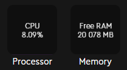

# HWInfoPlugin
Loupedeck plugin that adds tails with following stats:
- Processor usage
- Free memory in MB

Stat is refreshed every second.

## Installation
Install the latest version localy from `release` directory according [official the guide](https://support.loupedeck.com/install-a-plugin-from-a-file).

## Screenshot
